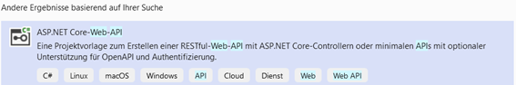

## Project Title
Sapl ASP.NET Core Security Integration

## Introduction
Similar to ASP.NET Core Security itself, the SAPL integration supports  blocking method security annotations.
Just like in ASP.NET Core Security, method security is not active by default and one of the two modes has to be activated.
While in ASP.NET Core Security Security it is sufficient to add the attribute [Authorize] or [Authorize(PolicyName="MyPolicy")]
on any configuration class, a specific configuration class has to be provided to activate the SAPL attributes alongside the ASP.NET Core Security method security attributes.

## Table of Contents
- Introduction
- Features
- Project Structure
- License
- Installation and usage

## Features
- **Authorization Decision Handling**: Manages various authorization decisions.
- **Subscription Management**: Supports tracking of authorization subscriptions.
- **Exception Handling**: Efficiently handles unknown exceptions.
- **Notification System**: Observes and notifies on authorization decision changes.
- **PDP Integration**: Enables interaction with Policy Decision Points.
- **Demo Applications**: Includes demos for Web API, minimal web API, and SignalR integration.
- **Security Implementations**: Features ASP.NET Core Security integration.

## Project Structure
1. **PDP.Api**: The core API for handling policy decision logic.
2. **PDP.Client**: A client library for interacting with the PDP API.
3. **Web-API-Demo**: A demonstration of the API's integration in a traditional web application.
4. **Minimal-Web-API-Demo**: A minimalistic demo showcasing a lightweight implementation.
5. **SignalR-Demo**: An application showcasing real-time updates using SignalR.
6. **SAPL.AspNetCore.Security**: Security aspects specifically tailored for ASP.NET Core.
7. **Test Projects**: Unit tests and integration tests for the above components.

## License
This project is licensed under the Apache License, Version 2.0. See [LICENSE](http://www.apache.org/licenses/LICENSE-2.0) for details.

## Installation and usage

### Create a ASP.NET Core Web API with ASBAC/SAPL-Autorization

This tutorial teaches the basics of building a controller-based web API that uses no database.

#### Prerequisites

Install Visual Studio 2022 with ASP.NET and web developement


#### Create a web project

- From the **File** menu, select **New** > **Project**.
- Enter _Web API_ in the search box.
- Select the **ASP.NET Core Web API** template and select **Next**.



In the **Configure your new project dialog**, name the project _DemoApi_ and select **Next**.


- In the **Additional information** dialog:
- Confirm the **Framework** is **.NET 8.0 (Long Term Support)**.
- Confirm the checkbox for **Use controllers(uncheck to use minimal APIs)** is checked.
- Confirm the checkbox for **Enable OpenAPI support** is checked.
- Select **Create**.


#### Install the SAPL-NuGet packages

A NuGet package must be added to support the Itegration used in this install-guide.

- From the Tools menu, select NuGet Package Manager => Manage NuGet Packages for Solution
- Select the Browse tab
- Enter **PDP.Api** in the search box, and then select **PDP.Api**
- Select the Project checkbox in the right pane and then select Install
- Enter **PDP.Client** in the search box, and then select **PDP.Client**
- Select the Project checkbox in the right pane and then select Install
- Enter **SAPL.AspNetCore.Security** in the search box, and then select **SAPL.AspNetCore.Security**
- Select the Project checkbox in the right pane and then select Install


#### Test the project

Press Ctrl+F5 to run without the debugger.

Visual Studio displays the following dialog when a project is not yet configured to use SSL:


Select Yes if you trust the IIS Express SSL certificate.

The following dialog is displayed:


Select Yes if you agree to trust the development certificate.

### Set connection to SAPL-Server

##### Storing the access data for SAPL-Server lt

Open the File appsettings.json add the following content and save the file.

```
"SAPL": {
  "BaseUri": "https://localhost:8443",
  "Username": "YJidgyT2mfdkbmL",
  "Password": "Fa4zvYQdiwHZVXh"
}
```


### Add the SAPL/ASBAC components to the request-response-pipeline

##### Add necessary namespaces to Program.cs

To register the SAPL components in the application, open the Program.cs file and add the namespaces
```CS
  using SAPL.AspNetCore.Security.Authentication;
  using SAPL.AspNetCore.Security.Constraints.api;
  using SAPL.AspNetCore.Security.Extensions;
  using SAPL.AspNetCore.Security.Middleware.Exception;
  using SAPL.WebAPIDemo.ExampleData.Data;
```
to the head of the file.

<!------>

##### Registrate base components with bearer token autentication

To register the necessary basic components as DI services in the application, it's necessary to specify the type of authentication. Currently, Bearer Token Authentication is supported. Each request to the application requires the provision of an Authorization header containing an encrypted token. The registration can be carried out as follows.

```Csharp
builder.Services.AddControllers();
// Learn more about configuring Swagger/OpenAPI at https://aka.ms/aspnetcore/swashbuckle
builder.Services.AddEndpointsApiExplorer();
builder.Services.AddSwaggerGen();

builder.Services.AddDefaultSaplServices(builder.Configuration, AuthenticationType.Bearer_Token);
```
<!------>

###### Add secret key for Bearer Token authentication

For the use of token-based authentication, it is necessary to specify a key in the appsettings.json file. For this purpose, the following content is added to the file. The key can, of course, be replaced by your own key.

```
"JWT": {
  "ValidAudience": "https://ftk-demo.com",
  "ValidIssuer": "https://ftk-demo.com",
  "Secret": "ByYM000OLlMQG6VVVp1OH7Xzyr7gHuw1qvUC5dcGt3SNM"
},
```

<!---!--->

##### Register base components with identity authentication

```C#
builder.Services.AddControllers();
// Learn more about configuring Swagger/OpenAPI at https://aka.ms/aspnetcore/swashbuckle
builder.Services.AddEndpointsApiExplorer();
builder.Services.AddSwaggerGen();

builder.Services.AddDefaultSaplServices(builder.Configuration, AuthenticationType.Identity);
```

##### Register base components with custom authentication

To use custom authentication methods, an object of type ISubjectFromAuthenticationBuilder must be implemented and passed into the registration.


##### Add SAPL-Middleware to the pipeline

To obtain a standardized error handling of access errors, it is necessary to place a middleware in the pipeline. This is also done in the Program.cs file as follows:

```C#
app.UseHttpsRedirection();
app.UseAuthorization();

app.UseMiddleware<AccessDeniedExceptionMiddleware>();
```
<!---!--->

##### Registrate constraint handler

The registration of the constraint handlers as DI services is also done in the Program.cs file under the specification of the interface IResponsibleConstraintHandlerProvider and takes place as follows:

```C#
builder.Services.AddSingleton<IResponsibleConstraintHandlerProvider, LoggingConsumerDelegateConstraintHandler>();
builder.Services.AddSingleton<IResponsibleConstraintHandlerProvider, LoggingDelegateConstraintHandler>();
builder.Services.AddSingleton<IResponsibleConstraintHandlerProvider, ManipulatePatientIdActionExecutingContextConstraintHandlerProvider>();
builder.Services.AddSingleton<IResponsibleConstraintHandlerProvider, FilterPatientsForUserTypedFilterPredicateConstraintHandlerProvider>();
builder.Services.AddSingleton<IResponsibleConstraintHandlerProvider, ReplacePatientIdActionExecutingContextConstraintHandlerProvider>();
builder.Services.AddSingleton<IResponsibleConstraintHandlerProvider, FilterPatientsForDepartmentTypedFilterPredicateConstraintHandlerProvider>();
```
<!---!--->

### Secure endpoints in controller based Web API

For securing multiple endpoints in a controller, it is first necessary to extend the controller with a "Route" attribute, which ensures the unique identification of an endpoint. To do this, the Route attribute is added as follows.

```C#
[ApiController]
[Route("api/[controller]")]
public class WeatherForecastController : ControllerBase
{
```
<!---!--->

#### PreEnforcement

For the use of PreEnforcement, a PreEnforce attribute is attached to the method to be secured in the respective controller. Within the attribute, parameters such as subject, action, resource, and environment can be set. If the parameters are not preset, the framework determines the attributes itself to create an authorization subscription. An example of a PreEnforce attribute specifying the subject can be seen in the following figure.

```C#
 [HttpGet("[action]")]
 [PreEnforce(subject: "SomeSubject")]
 public IEnumerable<WeatherForecast> Get()
 {
     return Enumerable.Range(1, 5).Select(index => new WeatherForecast
     {
         Date = DateOnly.FromDateTime(DateTime.Now.AddDays(index)),
         TemperatureC = Random.Shared.Next(-20, 55),
         Summary = Summaries[Random.Shared.Next(Summaries.Length)]
     })
     .ToArray();
 }
```
<!---!--->

##### Test the preenforcement

- Press Ctrl+F5 to run the app.
- In the Swagger browser window, select **GET /api/WeatherForecast/Get**, and then select **Try it out**.


- Select Execute
- In the Response body window you see „Access denied“ because of missing policy


- Write a new Policy like below and add it to your local PAP and try it again

```
policy "Example1"
permit 
subject == "SomeSubject"
where            
var actionname   = log.infoSpy("actionname     : ", action.ActionName);
                  log.infoSpy("is action permitted     : ", actionname == "Get");
```

<!------>

- Press Ctrl+F5 to run the app.
- In the Swagger browser window, select **GET /api/WeatherForecast/Get**, and then select **Try it out**.
- Select Execute
- In the Response body window you see the result


#### PostEnforcement

For using PostEnforcement, similarly to PreEnforcement, a PostEnforce attribute is attached to the method to be secured in the respective controller. Within the attribute, parameters such as subject, action, resource, and environment can be set. If the parameters are not pre-defined, the framework determines the attributes itself to create an authorization subscription.

Copy the Get method and rename it to GetTwo. An example of a PostEnforce attribute specifying the subject can be seen in the following figure.

```C#
[HttpGet("[action]")]
[PostEnforce(subject: "SomeSubject")]
public IEnumerable<WeatherForecast> GetTwo()
{
    return Enumerable.Range(1, 5).Select(index => new WeatherForecast
    {
        Date = DateOnly.FromDateTime(DateTime.Now.AddDays(index)),
        TemperatureC = Random.Shared.Next(-20, 55),
        Summary = Summaries[Random.Shared.Next(Summaries.Length)]
    })
        .ToArray();
}
```
<!------>

##### Test the postenforcement

- Write a new Policy like below and add it to your local PAP

```
policy "Example2"
permit 
subject == "SomeSubject"
where            
var actionname   = log.infoSpy("actionname     : ", action.ActionName);
                  log.infoSpy("is action permitted     : ", actionname == "GetTwo");
obligation  {
            "type": "filterJsonPathContent",
            "conditions": [
                            {
                            "path": "$.[?(@.Summary != 'X')]",       
                            "actions": [
                                        {
                                          "path": "Summary",
                                          "type": "blacken",
                                          "replacement": "XXX",
                                          "discloseLeft": "1",
                                          "discloseRight": "1"
                                        }
                                       ]
                            }
                          ]
            }
```

<!------>

- Press Ctrl+F5 to run the app.
- In the Swagger browser window, select **GET /api/WeatherForecast/GetTwo**, and then select **Try it out**.
- Select Execute


- In the Response body window you see the result


### Secure endpoints in minimal Web API

For securing endpoints in minimal Web API without controller, it is first necessary register endpointfilter in the Program.cs-file.

#### PreEnforcement

For the use of PreEnforcement, a PreEnforce-Filter hast o be registrated on the Endpoint in the Program.cs-file. An example of a registration of aPreEnforce-filter can be seen in the following figure.

```C#
app.MapGet("/weatherforecastPreEnforce", () =>
    {
        var forecast = Enumerable.Range(1, 5).Select(index =>
                new WeatherForecast
                (
                    DateOnly.FromDateTime(DateTime.Now.AddDays(index)),
                    Random.Shared.Next(-20, 55),
                    summaries[Random.Shared.Next(summaries.Length)]
                ))
            .ToArray();
        return forecast;
    })
    .WithName("GetWeatherForecastPre")
    .WithOpenApi().AddEndpointFilter(new PreEnforceEndPointFilter("SomeSubject", "Weather", "someResource", "SomeEnvironment"));
```
<!------>

#### PostEnforcement

For the use of PostEnforcement, a PostEnforce-Filter hast o be registrated on the Endpoint in the Program.cs-file. An example of a registration of aPreEnforce-filter can be seen in the following figure.

```C#
app.MapGet("/weatherforecastPostEnforce", () =>
{
    var forecast = Enumerable.Range(1, 5).Select(index =>
        new WeatherForecast
        (
            DateOnly.FromDateTime(DateTime.Now.AddDays(index)),
            Random.Shared.Next(-20, 55),
            summaries[Random.Shared.Next(summaries.Length)]
        ))
        .ToArray();
    return forecast;
})
.WithName("GetWeatherForecastPost")
.WithOpenApi().AddEndpointFilter(new PostEnforceEndPointFilter("SomeSubject", "Weather", "someResource", "SomeEnvironment"));
```
<!------>

### Secure endpoints in SignalR

For securing endpoints in a SignalR application without controller, it is first necessary register hubfilter in the Program.cs-file.

#### PreEnforcement

For the use of PreEnforcement, a PreEnforceHub-Filter hast o be registrated on the Endpoint in the Program.cs-file. An example of a registration of a PreEnforce-filter can be seen in the following figure.

```C#
builder.Services.AddSignalR(hubOptions =>
{
    hubOptions.AddFilter<PreEnforceHubFilter>();
});
```
<!------>

### Using implemented constraint handler for transformations

To manipulate the results of an endpoint during PostEnforcement, three different constraint handlers are offered, which do not require implementation and are controlled by a corresponding policy. These include "blacken," "replace," and "delete," which are described in the following.

##### Blacken

To redact content from the result of an endpoint, the "type" attribute within the obligation just needs to be set to "filterJsonPathContent" in the policy, and a valid JsonPath expression must be specified as "path". For redaction, "blacken" is specified as the type of the action. The following image shows an example of a corresponding policy.

```
policy "UseCase2b"
permit 
where
var role    = log.infoSpy("role     : ", subject.Role);
                  log.infoSpy("is clinicalAssistant     : ", role == "ClinicalAssistant");
var actionname   = log.infoSpy("actionname     : ", action.ActionName);
                  log.infoSpy("is action permitted     : ", actionname == "GetAllPatientsUserForJsonFilterBlackenDiagnosis");
obligation  {
            "type": "filterJsonPathContent",
            "conditions": [
                            {
                            "path": "$.[?(@.Diagnosis != 'X')]",       
                            "actions": [
                                        {
                                          "path": "Diagnosis",
                                          "type": "blacken",
                                          "replacement": "XXX",
                                          "discloseLeft": "1",
                                          "discloseRight": "1"
                                        }
                                       ]
                            }
                          ]
            }
```


##### Replace

To replace contents of a result from an endpoint with a specific value, the "type" attribute within the obligation must be set to "filterJsonPathContent" in the policy, and a valid JsonPath expression must be specified as "path". For the replacement, "replace" is specified as the type of the action. The following image shows an example of a corresponding policy.

```
policy "UseCase6"
permit 
where
var role    = log.infoSpy("role     : ", subject.Role);
                  log.infoSpy("is clinicalAssistant     : ", role == "ClinicalAssistant");
var actionname   = log.infoSpy("actionname     : ", action.ActionName);
                  log.infoSpy("is action permitted     : ", actionname == "GetAllPatientsUserForJsonFilterReplaceAddress");
obligation  {
            "type": "filterJsonPathContent",
            "conditions": [
                            {
                            "path": "$.[?(@.Address != 'X')]",       
                            "actions": [
                                        {
                                          "path": "Address",
                                          "type": "replace",
                                          "replacement": "anonym",
                                          "discloseLeft": "1",
                                          "discloseRight": "1"
                                        },
                                        {
                                          "path": "City",
                                          "type": "replace",
                                          "replacement": "anonym",
                                          "discloseLeft": "1",
                                          "discloseRight": "1"
                                        }
                                       ]
                            }
                          ]
            }
```

<!------>

##### Delete

To delete contents of a result from an endpoint, the "type" attribute within the obligation must be set to "filterJsonPathContent" in the policy, and a valid JsonPath expression must be specified as "path". For deletion, "delete" is specified as the type of the action. The following image shows an example of a corresponding policy.

```
policy "UseCase5"
permit 
where
var actionname   = log.infoSpy("actionname     : ", action.ActionName);
                  log.infoSpy("is action permitted     : ", actionname == "GetAllPatientsForJsonFilterDelete");
obligation  {
            "type": "filterJsonPathContent",
            "conditions": [
                            {
                            "path": "$.[?(@.Diagnosis == 'Broken Leg')]",       
                            "actions": [
                                        {                                          
                                          "type": "delete"                                          
                                        }
                                       ]
                            }
                          ]
            }
```

<!------>

### Implementing custom constraint handler

Here are some examples of how constraint handlers can be implemented for different purposes. For each example, the source code and a policy are illustrated.

##### Typed Filter

To filter results of an endpoint based on specific criteria contained in a policy, a constraint handler of type TypedFilterPredicateConstraintHandlerProviderBase<T> must be implemented. By specifying the type, filtering of the results based on a predicate can be performed. An example of implementation and the corresponding policy are depicted in the following figures.

```C#
using Newtonsoft.Json.Linq;
using SAPL.AspNetCore.Security.Constraints.Providers;
using SAPL.AspNetCore.Security.Subscription;
using SAPL.WebAPIDemo.ExampleData.Models;

namespace Web_API_Demo.Constraints
{
    // This class provides a constraint handler for filtering patients based on their department.
    // It extends TypedFilterPredicateConstraintHandlerProviderBase to apply filter predicates on Patient objects.
    public class FilterPatientsForDepartmentTypedFilterPredicateConstraintHandlerProvider : TypedFilterPredicateConstraintHandlerProviderBase<Patient>
    {
        // Field to store the name of the department to filter patients by.
        public string departmentToFilter = null!;

        /// <summary>
        /// Determines whether this handler is responsible for the given constraint.
        /// </summary>
        /// <param name="constraint">The JToken representing the constraint.</param>
        /// <returns>True if this handler should process the constraint; otherwise, false.</returns>
        public override bool IsResponsible(JToken constraint)
        {
            // Define the constraint type this handler is responsible for.
            string constraintType = "filterPatiensForDepartment";

            // Extract the obligation type from the constraint.
            string obligationType = ObligationContentReaderUtil.GetObligationType(constraint)!;

            // Check if the obligation type is not empty and matches the expected constraint type.
            if (!string.IsNullOrEmpty(obligationType))
            {
                // Retrieve the specific department to filter from the constraint.
                string filterValue = ObligationContentReaderUtil.GetPropertyValue(constraint, "filterDepartment")!;
                departmentToFilter = filterValue;

                // Return true if the obligation type matches the constraint type.
                return obligationType.Equals(constraintType);
            }

            // Return false if the constraint does not match the expected type.
            return false;
        }

        /// <summary>
        /// Provides a handler (predicate) for filtering patients by the specified department.
        /// </summary>
        /// <returns>A predicate that filters patients by their department.</returns>
        protected override Predicate<Patient> GetHandler()
        {
            // Return a predicate that checks if a patient belongs to the specified department.
            return p => p.Department.ToString().Equals(departmentToFilter);
        }
    }
}
```

<!------>

```
policy "UseCase4"
permit 
where
var actionname   = log.infoSpy("actionname     : ", action.ActionName);
                  log.infoSpy("is action permitted     : ", actionname == "GetAllPatientsForTypedFilter");
obligation  {
            "type": "filterPatiensForDepartment",
            "filterDepartment": ""+subject.Department+""                           
            }
```
<!------>

##### LoggingConsumerDelegateConstraintHandler

Ein constraint handler der Daten aus einer Policy in die Anwendung übergibt wird nach dem folgendem Muster implementiert. Hierbei ist das Interface IConsumerDelegateConstraintHandlerProvider&lt;string&gt; zu implementieren.

```C#
using System.Diagnostics;
using Newtonsoft.Json.Linq;
using SAPL.AspNetCore.Security.Constraints.api;

namespace Web_API_Demo.Constraints
{
    /// <summary>
    /// A constraint handler that provides logging functionality.
    /// It logs a message when a specific constraint is met.
    /// </summary>
    public class LoggingConsumerDelegateConstraintHandler : IConsumerDelegateConstraintHandlerProvider<string>
    {
        /// <summary>
        /// Returns the handler for the provided constraint.
        /// </summary>
        /// <param name="constraint">The JSON token representing the constraint.</param>
        /// <returns>The consumer delegate handler.</returns>
        public IConsumerDelegate<string> GetHandler(JToken constraint)
        {
            return this;
        }

        /// <summary>
        /// Indicates the signal on which this handler should be triggered.
        /// </summary>
        /// <returns>The signal at which this handler operates.</returns>
        public ISignal.Signal GetSignal()
        {
            return ISignal.Signal.ON_DECISION;
        }

        /// <summary>
        /// Determines if this handler is responsible for the provided constraint.
        /// </summary>
        /// <param name="constraint">The JSON token representing the constraint.</param>
        /// <returns>True if this handler is responsible, false otherwise.</returns>
        public bool IsResponsible(JToken constraint)
        {
            return constraint.Value<string>()!.Equals("logging:inform_admin");
        }

        /// <summary>
        /// Returns the action delegate that will be executed.
        /// </summary>
        /// <returns>The action delegate.</returns>
        public Action<string> Accept()
        {
            return Log;
        }

        /// <summary>
        /// Logs the provided message.
        /// </summary>
        /// <param name="message">The message to be logged.</param>
        public void Log(string message)
        {
            // This method logs the provided message to the debug output.
            Debug.WriteLine(message);
        }
    }
}
```

<!------>

The corresponding policy might look as follows:

```
policy "GetPatientsWithBrokenLeg"
permit 
where
var lastname    = log.infoSpy("lastname     : ", subject.LastName);
                  log.infoSpy("is user     : ", lastname == "Keinel");
var actionname   = log.infoSpy("actionname     : ", action.ActionName);
                  log.infoSpy("is action permitted     : ", actionname == "GetPatientsWithBrokenLeg");
obligation
{
	"logging": "log_access"
}
advice
    "logging:inform_admin"
```
<!------>

##### LoggingDelegateConstraintHandler

Constraint handlers that implement the IRunnableDelegateConstraintHandlerProvider interface do not take data from the policy and can be implemented for logging according to the following pattern.

```C#
/// <summary>
/// Provides a handler for logging related constraints, acting on specified signals.
/// This class can handle different logging actions like logging access or informing an admin.
/// </summary>
public class LoggingDelegateConstraintHandler : IRunnableDelegateConstraintHandlerProvider
{
    private ILoggerFactory loggerFactory;
    private ILogger logger;

    /// <summary>
    /// Constructor initializing the logger factory and logger.
    /// </summary>
    /// <param name="loggerFactory">Factory to create logger instances.</param>
    public LoggingDelegateConstraintHandler(ILoggerFactory loggerFactory)
    {
        this.loggerFactory = loggerFactory;
        this.logger = loggerFactory.CreateLogger<LoggingDelegateConstraintHandler>();
    }

    // List of responsible items (logging actions) this handler can manage.
    private readonly List<ResponsibleItem> resposibleFor = new List<ResponsibleItem>()
    {
       new ResponsibleItem("logging","log_access",new List<ResponsibleItem>()),
       new ResponsibleItem("logging", "inform_admin", new List<ResponsibleItem>())

    };

    /// <summary>
    /// Provides a specific handler based on the constraint.
    /// </summary>
    /// <param name="constraint">The JSON token representing the constraint.</param>
    /// <returns>A runnable delegate handling the specific logging action.</returns>
    public IRunnableDelegate GetHandler(JToken constraint)
    {
        if (resposibleFor.ElementAt(1).IsMatch(constraint))
        {
            return new InformAdminConstraintHandler(loggerFactory);
        }
        return this;
    }


    /// <summary>
    /// Specifies the signal on which this handler operates.
    /// </summary>
    /// <returns>The signal for the handler.</returns>
    public ISignal.Signal GetSignal()
    {
        return ISignal.Signal.ON_DECISION;
    }

    /// <summary>
    /// Determines if this handler is responsible for the given constraint.
    /// </summary>
    /// <param name="constraint">The JSON token representing the constraint.</param>
    /// <returns>True if responsible, false otherwise.</returns>
    public bool IsResponsible(JToken constraint)
    {
        return resposibleFor.Any(r => r.IsMatch(constraint));
    }


    /// <summary>
    /// Returns the action delegate to be executed for logging.
    /// </summary>
    /// <returns>An action for logging.</returns>
    public Action Run()
    {
        return Log;
    }


    /// <summary>
    /// Logs a generic message indicating successful logging.
    /// </summary>
    private void Log()
    {
        if (logger != null)
        {
            logger.Log(LogLevel.Information, "Logged successfully");
        }
        else
        {
            Debug.WriteLine($"{nameof(LoggingDelegateConstraintHandler)} logged successfully");
        }
    }
}
```

<!------>

Or for the simpler cases:

```C#
/// <summary>
/// Specific constraint handler for logging an 'inform admin' action.
/// </summary>
public class InformAdminConstraintHandler : IRunnableDelegate
{
    private readonly ILogger logger;

    /// <summary>
    /// Initializes the handler with a logger.
    /// </summary>
    /// <param name="loggerFactory">Factory to create logger instances.</param>
    public InformAdminConstraintHandler(ILoggerFactory loggerFactory)
    {
        this.logger = loggerFactory.CreateLogger<InformAdminConstraintHandler>(); ;
    }

    /// <summary>
    /// Provides the action to log an 'inform admin' message.
    /// </summary>
    /// <returns>An action for logging 'inform admin'.</returns>
    public Action Run()
    {
        return LogInformAdmin;
    }

    /// <summary>
    /// Logs a specific message for the 'inform admin' action.
    /// </summary>
    private void LogInformAdmin()
    {
        if (logger != null)
        {
            logger.Log(LogLevel.Information, "Logged 'Inform admin' successfully");
        }
        else
        {
            Debug.WriteLine($"{nameof(LoggingDelegateConstraintHandler)} logged 'Inform admin' successfully");
        }
    }
}
```

<!------>

##### Manipulate methodinvocation

To manipulate parameters of a called method of an endpoint, the IActionExecutingContextConstraintHandlerProvider interface is implemented. An example is shown in the following figure.

```C#
using Microsoft.AspNetCore.Mvc.Filters;
using Newtonsoft.Json.Linq;
using SAPL.AspNetCore.Security.Constraints;
using SAPL.AspNetCore.Security.Constraints.api;

namespace Web_API_Demo.Constraints
{
    /// <summary>
    /// Provides a constraint handler for manipulating patient IDs in the context of an action being executed.
    /// It acts on specific constraints that match the criteria defined in 'responsibleFor'.
    /// </summary>
    public class ManipulatePatientIdActionExecutingContextConstraintHandlerProvider : IActionExecutingContextConstraintHandlerProvider
    {
        private List<ResponsibleItem> resposibleFor = new()
            { new ResponsibleItem("manipulating", "changeId", new List < ResponsibleItem >()) };

        /// <summary>
        /// Specifies the signal on which this handler operates.
        /// </summary>
        /// <returns>The signal for the handler.</returns>
        public ISignal.Signal GetSignal()
        {
            return ISignal.Signal.ON_DECISION;
        }

        /// <summary>
        /// Determines if this handler is responsible for the given constraint.
        /// </summary>
        /// <param name="constraint">The JSON token representing the constraint.</param>
        /// <returns>True if responsible, false otherwise.</returns>
        public bool IsResponsible(JToken constraint)
        {
            return resposibleFor.Any(r => r.IsMatch(constraint));
        }

        /// <summary>
        /// Returns the action delegate to manipulate the patient ID.
        /// </summary>
        /// <returns>An action for manipulating patient ID.</returns>
        public Action<ActionExecutingContext> Accept()
        {
            return Manipulate;
        }

        /// <summary>
        /// Manipulates the patient ID in the action executing context.
        /// Specifically, changes the ID from 1 to 2 if found.
        /// </summary>
        /// <param name="context">The action executing context containing action arguments.</param>
        private void Manipulate(ActionExecutingContext context)
        {
            IDictionary<string, object?> originalArguments = context.ActionArguments;
            IDictionary<string, object?> newArguments = new Dictionary<string, object?>(originalArguments);

            foreach (KeyValuePair<string, object?> argument in newArguments)
            {
                if (argument.Value is int value)
                {
                    if (value == 1)
                    {
                        newArguments[argument.Key] = 2;
                    }
                }
            }
            context.ActionArguments.Clear();
            foreach (var (key, value) in newArguments)
            {
                context.ActionArguments.Add(key, value);
            }
        }

        /// <summary>
        /// Provides the handler for the provided constraint.
        /// </summary>
        /// <param name="constraint">The JSON token representing the constraint.</param>
        /// <returns>The consumer delegate handler.</returns>
        public IConsumerDelegate<ActionExecutingContext> GetHandler(JToken constraint)
        {
            return this;
        }
    }
}
```

<!------>

The corresponding policy might look as follows:

```
policy "UseCase3"
permit 
where
var id    = log.infoSpy("id     : ", subject.Id);                  
var actionname   = log.infoSpy("actionname     : ", action.ActionName);
                  log.infoSpy("is action permitted     : ", actionname == "GetPatientByIdForPatient");
obligation
{
	"manipulating": "changePatientId",
    "id"          : ""+subject.Id+""
}
```

<!------>
